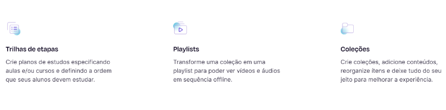

# Teste técnico assíncrono

👀 A interface
Pixels importam pra gente. 😊
https://www.figma.com/file/M0jy5rqNumytQKuKZYhgPS/Ensinio-Frontend-Challenge
💡 A proposta
Você foi encarregado de dar os primeiros passos em uma aplicação que tende a escalar, sendo responsável por desenvolver a "seção hero" de uma tela institucional (interface demonstrada acima), utilizando HTML, CSS, JavaScript ou TypeScript (gostamos de TS, mas a escolha é sua) e React.js ou Next.js (gostamos de Next.js, mas a escolha é sua). 😃
Encorajamos o uso de bibliotecas CSS-in-JS como styled-components. Para as finalidades deste teste, não gostaríamos de ver você usando Bootstrap, Tailwind CSS e congêneres.
Você deve estar preparado para justificar eventuais decisões técnicas.
Para a seção abaixo (vide imagem), os títulos e descrições dos itens devem ser requisitados de uma API fictícia. Utilize o json-server para simular uma API com o arquivo "db.json" contido neste repositório.

Por fim, forneça uma documentação, por meio de um arquivo README.md, acerca do seu projeto. Inclua instruções para a execução da aplicação, detalhes acerca da estrutura do projeto e comentários que julgar pertinentes à avaliação.
🎯 Requisitos do projeto
• A interface deve ser 100% responsiva;
• Usabilidade impecável (botões devem ter cursor do tipo pointer, feedbacks visuais de hover, etc);
• Requisitar dados (presentes no arquivo "db.json") de uma API fictícia utilizando json-server;
• Implementar a funcionalidade de internacionalização (todos os textos da aplicação devem possuir variações para os idiomas português, inglês e espanhol; a seleção do idioma, por parte do usuário, deve ser persistida);
• Hospedar a aplicação, permitindo o acesso através de uma URL (você pode usar plataformas gratuitas, como Vercel, Netlify, Heroku e afins);
• Fornecer uma documentação, incluindo instruções para a execução da sua aplicação.

👏 Diferenciais
• Testes unitários

📄 Critérios de avaliação
• A qualidade do seu código;
• O cumprimento dos requisitos;
• A fidelidade da interface codificada;
• A estrutura do seu projeto: esperamos ver componentização coesa, reuso, etc;
• A responsividade da aplicação: deve adaptar-se com maestria para absolutamente qualquer tamanho de tela, desde pequenos smartphones até monitores ultrawide;
• Seu empenho: não tem problema se algo não sair como desejado, mas tente! 😊

🔒 Autoria
O projeto desenvolvido durante o teste em questão não será utilizado para quaisquer outros fins além da sua avaliação.
⚠️ Atenção
Não serão avaliados testes técnicos cuja aplicação não esteja hospedada. O acesso deve estar disponível através de uma URL (você pode usar plataformas gratuitas, como Vercel, Netlify, Heroku e afins), que obrigatoriamente deve ser informada na documentação e email de entrega.
📧 Sobre a entrega
Pedimos que, por gentileza, entregue o teste em até 6 dias a partir do recebimento das instruções (ou seja, até dia 23, terça-feira, ás 15h) respondendo à essa mesma conversa de email onde enviamos o link do desafio e incluindo o link de um repositório privado no GitHub. Neste repositório, adicione como colaboradores os usuários @ensiniodevfront (front@ensinio.com) e @silviow (silvio.mms2016@gmail.com). No email, envie também o link para preview online da aplicação. :)
